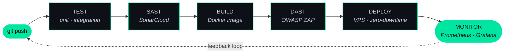

<div align="center">


<br/>

[](https://muhammedasef.com)
[](https://www.linkedin.com/in/muhammedasef)
[](https://medium.com/@asefkmv4)
[](mailto:asefkmv4@gmail.com)

</div>

<br/>

## `[stage 1/5]` &nbsp;INIT — whoami

```yaml
name:       Muhammed Asef
role:       Management Information Systems (Senior) @ Bursa Uludağ University
focus:      DevSecOps · Application Security · Secure CI/CD
location:   Türkiye
status:     seeking DevSecOps / AppSec internship
```

I'm a final-year Management Information Systems student who ended up spending far more
time in a terminal than in a spreadsheet. My interest sits in a specific place: **the seam
between shipping software fast and shipping it safely** — the part where security stops
being a checklist somebody signs at the end and becomes a stage in the pipeline that fails
the build.

That interest turned into a graduation thesis on the cost impact of shift-left security,
a TÜBİTAK-funded research project on automated vulnerability scanning, and a habit of
rebuilding my own infrastructure until every deploy passes through a gate that can reject it.

I learn by building the whole thing end to end — scanner, pipeline, panel, VPS, monitoring —
because that's the only way I've found to understand where security actually breaks.

<br/>

## `[stage 2/5]` &nbsp;BUILD — how I ship

Every push to my personal infrastructure runs through this. Nothing reaches production
without clearing all five stages:



The point of this isn't the tooling — it's that a vulnerability found at the SAST stage
costs a fraction of what the same vulnerability costs after release. That gap is what my
thesis measured, and it's the reason I build this way rather than bolting a scan onto the end.

<br/>

## `[stage 3/5]` &nbsp;DEPLOY — what I've built

### 🛡 InfraGuard Studio

A browser-based security scanner for Infrastructure-as-Code. You drop in a Dockerfile,
Kubernetes manifest or Terraform plan, and it flags misconfigurations — privileged containers,
exposed secrets, missing resource limits, permissive security groups — then offers a concrete
fix for each one.

**87+ detection rules** across three IaC formats, **36 automated fix functions**, multi-file
zip upload, and scan history stored locally. The design constraint that shaped everything:
**nothing is uploaded to a server.** All parsing and analysis runs client-side, because asking
engineers to send infrastructure config to a third party is exactly the wrong ask. Hardened
with a nonce-based Content Security Policy.

`Next.js` `TypeScript` `IaC Security` `CSP Hardening`

**→ [infraguard.muhammedasef.com](https://infraguard.muhammedasef.com)**

---

### 🔎 AI-Assisted Vulnerability Scanner &nbsp;·&nbsp; *TÜBİTAK 2209-A*

A funded undergraduate research project tackling a real problem with automated scanners:
they produce enormous amounts of output, much of it false positives, and almost none of it
explains what an engineer should actually do about it.

The system runs a **7-stage pipeline** — Katana crawls the target, Nuclei and OWASP ZAP scan
it, a Context Engine correlates findings across tools, an Enrichment layer attaches CVSS v3.1
scores and CVE data, and an AI Guide produces remediation advice. Cross-validation between
scanners plus active verification cuts the false-positive rate substantially, so what reaches
the analyst is a triaged list rather than a raw dump.

The language model runs **locally via Ollama** — no findings leave the environment, which is
non-negotiable if this is ever pointed at real infrastructure. Wrapped in a Next.js panel over
a FastAPI backend.

`FastAPI` `Next.js` `Ollama` `Nuclei` `OWASP ZAP` `CVSS v3.1`

*Private repository — happy to walk through the architecture on request.*

---

### 🌐 muhammedasef.com

My portfolio and blog, but mostly an excuse to run production infrastructure I'm fully
responsible for. Self-hosted on a Debian VPS behind the 5-stage pipeline above.

Next.js 16 and TypeScript on the front, Prisma over PostgreSQL with Redis caching behind it,
containerised with Docker and deployed through GitLab CI/CD. Includes internationalisation
with automated translation, a Markdown-driven blog module, an admin panel, Prometheus and
Grafana for metrics, and a full set of hardened HTTP security headers.

`Next.js` `TypeScript` `Prisma` `PostgreSQL` `Redis` `Docker` `GitLab CI/CD`

**→ [muhammedasef.com](https://muhammedasef.com)**

---

### 💊 EczSearch

A published Android application for locating on-duty pharmacies — the kind of problem that
sounds trivial until you need it at 3am and every available option is a broken government
website. Live on Google Play.

`Mobile` `Published`

**→ [Google Play](https://play.google.com/store/apps/details?id=com.muhammed.eczsearch)**

<br/>

## `[stage 4/5]` &nbsp;TOOLING — what I work with

```
Security          OWASP ZAP · Nuclei · Katana · SonarCloud · SAST/DAST · CVSS v3.1
                  IaC scanning · Threat modelling · Security headers · CSP

Ops               Docker · Kubernetes · Terraform · GitLab CI/CD · GitHub Actions
                  Nginx · Debian · Prometheus · Grafana

Development       Python · TypeScript · C# · Next.js · FastAPI
                  PostgreSQL · Redis · Prisma
```

<br/>

## `[stage 5/5]` &nbsp;CONTACT

I write about shift-left security and DevSecOps practice on
**[Medium](https://medium.com/@asefkmv4)** and on my
**[blog](https://muhammedasef.com)**.

Currently looking for a **DevSecOps / Application Security internship** — and always up for
a conversation about pipeline security, IaC scanning, or why your build should fail more often.

<div align="center">
<br/>

[](https://muhammedasef.com)
[](https://www.linkedin.com/in/muhammedasef)
[](mailto:asefkmv4@gmail.com)

<sub><code>exit 0</code></sub>

</div>
